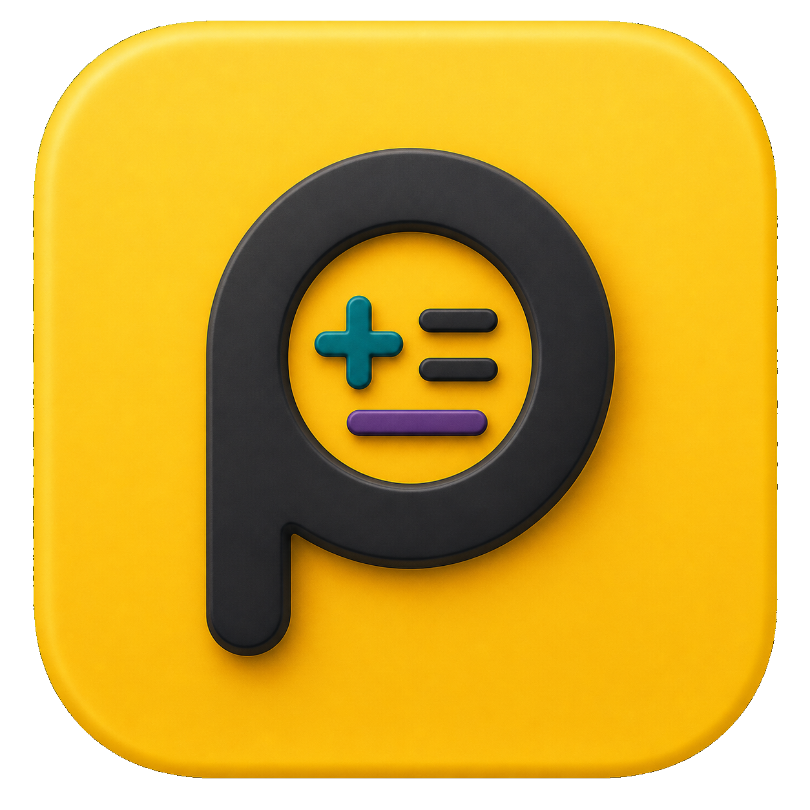
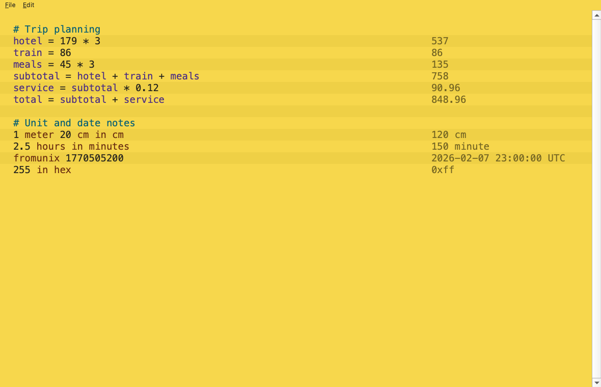
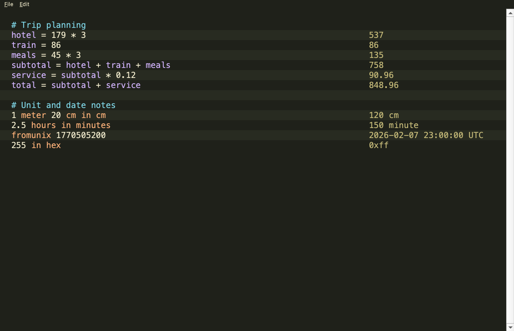

<p align="center">
  
</p>

<h1 align="center">Pnumi</h1>

Pnumi is an original Python/PySide6 rewrite of a Numi-style natural language calculator. It is based on public Numi documentation and intentionally omits Alfred integration and JavaScript plugin extensions.

## Screenshots

Light theme:



Dark theme:



## Run

```sh
python -m venv .venv
.venv/bin/pip install -e ".[dev]"
.venv/bin/python -m pnumi
```

## Test

```sh
.venv/bin/pytest
```

## Build macOS App

```sh
./scripts/build_macos_app.sh
```
